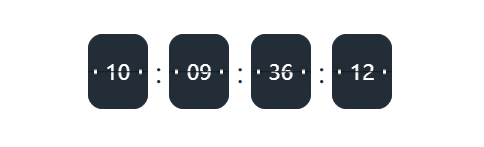
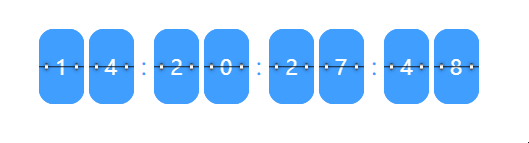
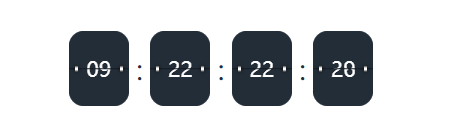
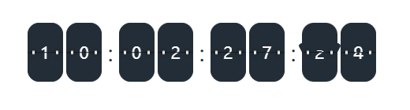
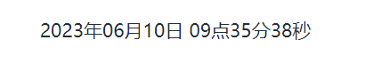
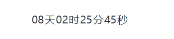

# vue-turn-clock  [](https://github.com/limintao/vue-turn-clock/blob/master/LICENSE) [](https://www.npmjs.com/package/vue-turn-clock) [](https://www.npmjs.com/package/vue-turn-clock) [](https://www.npmjs.com/package/vue-turn-clock)

这是一个简单的翻页倒计时组件，也可以是展示当前时间！

### 安装

With NPM:
```
npm install vue-turn-clock
```
With Yarn:
```
yarn add vue-turn-clock
```
With PNPM:
```
pnpm add vue-turn-clock
```

### 使用

```vue
import TurnClock from 'vue-turn-clock';

<TurnClock @over="timeOverEvent" endTime="2023-06-10" />
```

### 参数配置
| 名称        | 类型 | 默认 | 说明 |
|-----------| -- | -- |------------------------------------------------------------------------------------|
| startTime | Date/Number/String | Date.now() | 需要设置当前的初始化系统时间，可以是Date对象，也可以是时间戳，亦可是一个可被转换的时间字符串，主要用来防止用户修改电脑时间，设置初始化服务器时间 |
| endTime   | Date/Number/String | -- | 需要倒计时的时间，可以是Date对象，也可以是时间戳，亦可是一个可被转换的时间字符串 |
| formatter | String | YYYY-MM-DD HH:mm:ss | 当仅显示日期格式时，可限制显示的日期格式，可选的字符格式：['YYYY', 'MM', 'DD', 'HH', 'mm', 'ss']，必须是这些其中的，区分大小写 |
| units     | String[] | [':', ':', ':', ''] | 要给每个时间层级后面添加的字符 |
| theme     | combine/separate/text | combine | 要展示的样式，`combine` :每个层级的数字合并显示，`separate` :每个层级的数字单独显示，`text` :当做纯文本格式显示 |
| color     | String | -- | 数字的颜色 |
| bgColor   | String | -- | 卡片的背景色和分隔符的颜色，一般分隔符和卡片背景是一个颜色，如需设置不同颜色请自行用样式覆盖 |

### 事件
| 事件名 | 说明 | 类型 |
| -- | -- | -- |
| over | 倒计时时间走完时触发 | Function |

### 示例
| 代码 | 效果 |
| -- | -- |
| ```<TurnClock />``` |  |
| ```<TurnClock theme="separate" />``` |  |
| ```<TurnClock endTime="2023-06-20" theme="combine" bgColor="rgb(35, 45, 55)" />``` |  |
| ```<TurnClock :endTime="new Date('2023-06-20 12:00:00')" bgColor="rgb(35, 45, 55)" theme="separate" />``` |  |
| ```<TurnClock theme='text' />``` |  |
| ```<TurnClock theme='text' formatter="YYYY年MM月DD日 HH点mm分ss秒" />``` |  |
| ```<TurnClock theme="text" :units="['天', '时', '分', '秒']" endTime="2023-06-18 12:00:00" />``` |  |

* 有什么问题欢迎随时提Issues！😊
